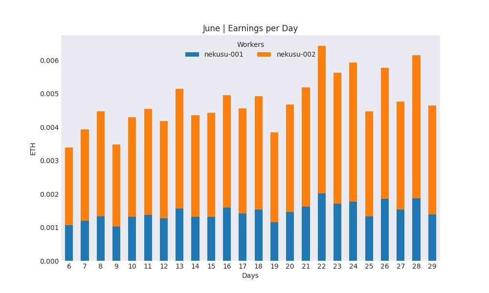
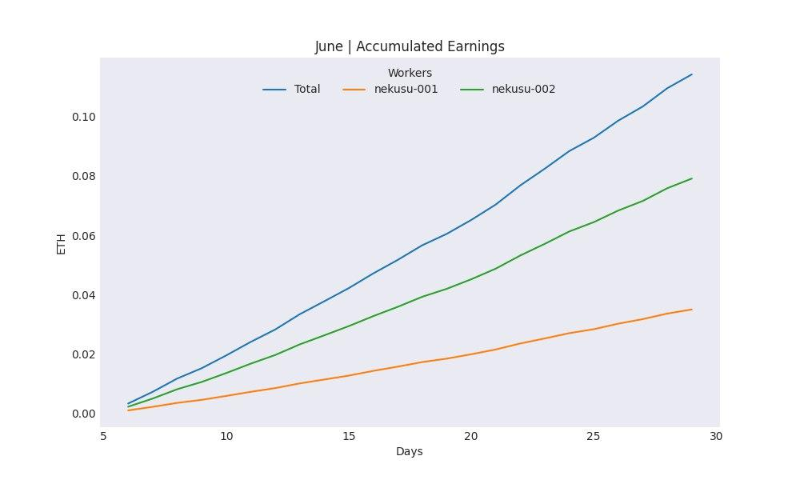

# flexworkers-bot

**_Python 3.x required._**

## USAGE

- Install required libraries using: `pip install -r requirements.txt`.
- Obtain your [Telegram API ID](https://core.telegram.org/api/obtaining_api_id).
- Create a bot with [@BotFather](https://t.me/botfather) in Telegram.
- Set your API ID, API Hash and the token provided by BotFather in `config.ini`.
- Set your Telegram username or [User ID](https://t.me/getmyid_bot), Flexpool ETH address and preferred currency in `config.ini`.
- Set your ZIL address in case one of your workers has it as a name, and the name that will replace it in `config.ini`
- Run `bot.py`.

The bot begins to collect data from the day it's run for the first time, it's impossible to obtain the earnings of each worker from previous days.

The script **must be running all the time** to collect daily data from the Flexpool API and for the bot to receive the commands.

In the event that one day's data has not been collected, the earnings will be accumulated along with those of the following day but won't be accurate for each worker.

## Available Commands

- **/help**  - See all available commands.
- **/day** _yesterday_ | _YYYY-mm-dd_ - Get earnings.
- **/summary** _start_ | _end_ - Get summary.
- **/price** _currency_ - Get current ETH price.
- **/estimated** _days_ - Get estimated earnings.
- **/currency** _symbol_ - Change your currency.
- **/workers** - List workers.

## Summaries Examples

**Libraries:** [Flexpool API](https://github.com/flexpool/py-flexpoolapi), [Cryptocompare](https://github.com/lagerfeuer/cryptocompare), [Pyrogram](https://github.com/pyrogram/pyrogram)
